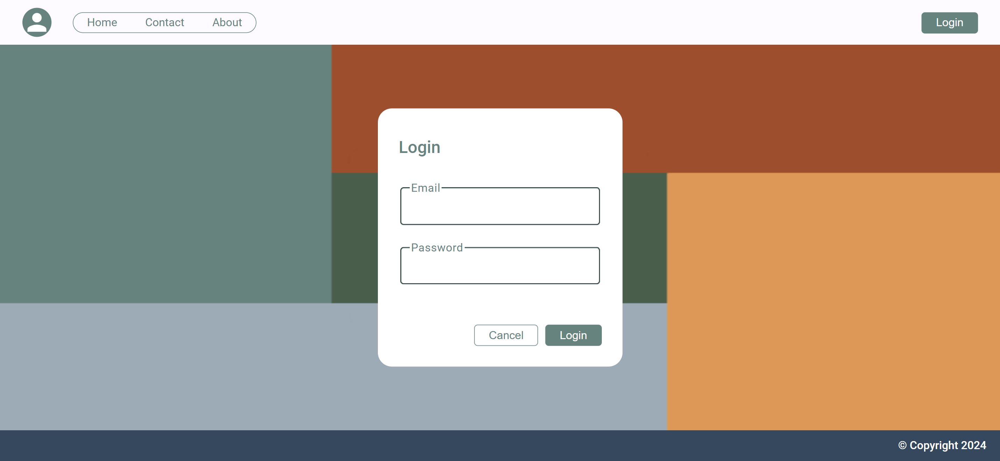

# Quantori

This project was implemented for Quantori JavaScript Boot Camp 2024.

1. Deploy: https://quantorimagadanov.netlify.app/
2. Start 08.08.2024 / End 10.08.2024 / Deadline 14.08.2024

## 🔎 Screenshot

## ⚠️ Warning

To log in to the application, just enter any email address and password that meet the requirements. Because the constant username and password that are specified in dummy are already set.

## 📌 Important

There are points that I didn't clearly understand.

- The application was implemented according to my logic, corresponding to the provided user interface design
- Added guards if you couldn't navigate a certain path

## 🛠️ Development server

Run `ng serve` for a dev server. Navigate to `http://localhost:4200/`. The application will automatically reload if you change any of the source files.

## 🌐 Build

Run `ng build` to build the project. The build artifacts will be stored in the `dist/` directory.

## ✨Further implementation

- Implementation of the login/logout button in the header
- Adding a user image and username for sidenav and header
- Page implementation
